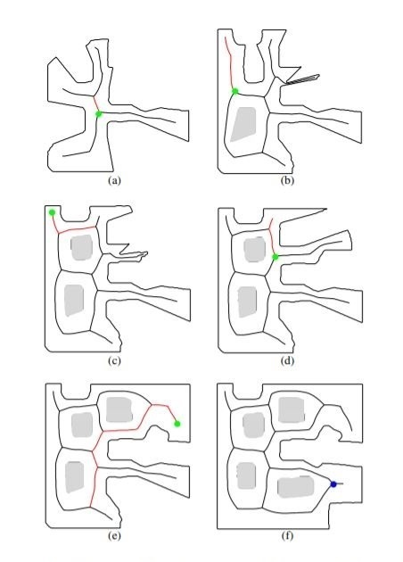
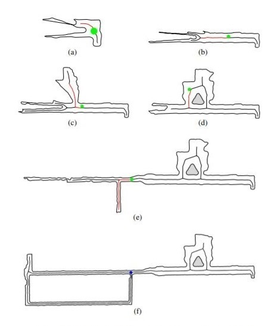

# Robust Environment Mapping Using Flux Skeletons

<p align = "center">
  </p>


## Updating
Assuming you have not made any local changes to these files, you can update your local code to the newest version with [git pull](https://git-scm.com/docs/git-pull).
Open a terminal, navigate to your `IROS2015/` folder, and run
```
git pull
```

If you have edited any files, `git pull` may throw errors. You can update while keeping your local changes by running:
```
git stash
git pull
git stash pop
```

If you are new to git, you can learn more about it [here](https://git-scm.com/doc)
<br>
<br>

## References
If you use the our IROS2015 package, we appreciate it if you cite the following papers:

```
@inproceedings{rezanejad2015robust,
  title={Robust environment mapping using flux skeletons},
  author={Rezanejad, Morteza and Samari, Babak and Rekleitis, I and Siddiqi, Kaleem and Dudek, Gregory},
  booktitle={2015 IEEE/RSJ International Conference on Intelligent Robots and Systems (IROS)},
  pages={5700--5705},
  year={2015},
  organization={IEEE}
}
```

## Contact
For any question regarding this package, please contact morteza@cim.mcgill.ca

## License
This program is free software: you can redistribute it and/or modify
it under the terms of the GNU General Public License as published by
the Free Software Foundation, either version 3 of the License, or
(at your option) any later version.

This program is distributed in the hope that it will be useful,
but WITHOUT ANY WARRANTY; without even the implied warranty of
MERCHANTABILITY or FITNESS FOR A PARTICULAR PURPOSE.  See the
GNU General Public License for more details.

You should have received a copy of the GNU General Public License
along with this program.  If not, see <https://www.gnu.org/licenses/>.
